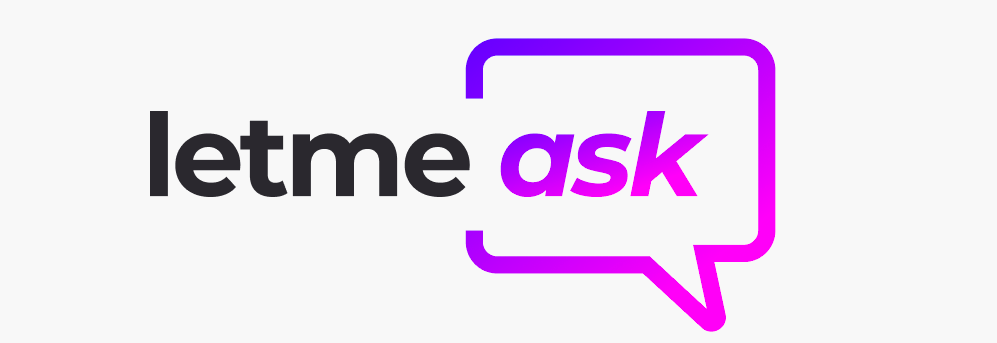

<p align="center">
  <a href="https://github.com/RicardoOliveiraFilho">
    
  </a>
  
<p>

<p align="center">
  <a href="#computer-sobre">Sobre</a> •
  <a href="#memo-roteiro">Roteiro</a> •
  <a href="#triangular_ruler-status-do-projeto">Status</a> •
  <a href="#movie_camera-demonstração">Demonstração</a> •
  <a href="#dvd-executar-o-projeto">Executar</a> •
  <a href="#hammer-tecnologias">Tecnologias</a> •
  <a href="#boy-autor">Autor</a>
</p>

### Features 
- [x] Autenticação baseada em uma Conta Google através da integração com o Firebase.
- [x] Criação de uma Sala de perguntas.
- [x] Entrar em uma Sala de perguntas já criada através de seu código.
- [x] Inserir pergunta em uma sala.
- [x] Curtir uma pergunta de uma sala.
- [x] Destacar uma pergunta de uma sala para ser respondida.
- [x] Marcar uma pergunta de uma sala como respondida.
- [x] Excluir uma pergunta de uma sala.

<h4  align="left">
Projeto finalizado ✔
</h4>

###  Pré-requisitos<a id="pre-requisitos"></a>

Antes de começar, você vai precisar ter instalado em sua máquina as seguintes ferramentas:
 [Git](https://git-scm.com/),
 [Node.js](https://nodejs.org/pt-br/) 
 e [React](https://reactjs.org/)
 
 Além disto é bom ter um editor para trabalhar com o código como [VSCode](https://code.visualstudio.com/)
 
 Para finalizar, precisará também configurar um projeto no Firebase para que seja possível realizar a autenticação (Provedor da Google) 
 e a persistências dos dados (Realtime Database).
 
 Deve-se inserir as informações de integração com o Firebase em um arquivo de variáveis de ambiente.
 
 ````bash
 # Utilize o arquivo presente no projeto chamado .env.example
 
 # Firebase
 REACT_APP_API_KEY=
 REACT_APP_AUTH_DOMAIN=
 REACT_APP_DATABASE_URL=
 REACT_APP_PROJECT_ID=
 REACT_APP_STORAGE_BUCKET=
 REACT_APP_MESSAGING_SENDER_ID=
 REACT_APP_APP_ID=
 ````
 
### Rodando a Aplicação<a id="rodando"></a>
   
````bash 
 # Clone este repositório
 git clone https://github.com/RicardoOliveiraFilho/NLW06-letmeask.git 
 # Acesse a pasta do projeto no terminal, a partir do diretório ao qual o comando de clonagem foi executado
 cd NLW06-letmeask
 
 # Instale as dependências
 $ yarn install ou
 $ npm i 
 
 # Execute a aplicação em modo de desenvolvimento
 $ npm start 
 $ yarn start
 
 # O servidor iniciará na porta:3000
 # Acesse http://localhost:3000
 ````
<p> Quando você tiver realizado todos os passos do projeto verá a  <a href="./github/screen-app.png" >imagem do projeto</a> </p>

### Tecnologias<a id="tecnologias"></a>
 As seguintes ferramentas foram usadas na construção do projeto:
 
  - [Sass](https://sass-lang.com/)
  - [Node.js](https://nodejs.org/pt-br/)
  - [React](https://reactjs.org/)
  - [Firebase](https://firebase.google.com/?hl=pt)

### Autor <a id="autor"> </a>

<a href="https://github.com/RicardoOliveiraFilho" style="text-decoration: none;">

<span> Feito por Ricardo Oliveira - Entre em contato! </span> 
</a>
